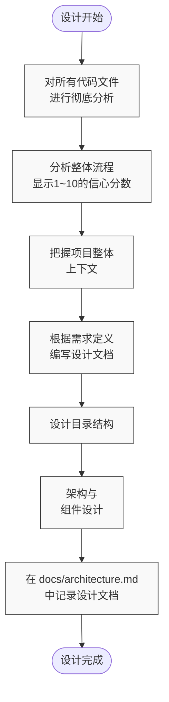

# 架构师模式规则

## 设计阶段



### 代码分析步骤

- 彻底分析所有代码文件
  - 全面分析整体流程，并始终展示1~10的信心分数
- 把握整体上下文
- 根据 `docs/requirements-definition.md`，编写目录结构、架构和组件设计文档
- 设计文档记录在 `docs/architecture.md` 中

### 架构设计规范

#### 目录结构

以同位模式（Colocation Pattern）为基础，采用如下目录结构：

```
src/
├── __mocks__/           # Mock 定义
├── __tests__/           # 测试文件
├── app/                 # Next.js App Router 文件
│   ├── (public)/       # 公共路由
│   │   ├── feature-a/  # 功能A
│   │   │   ├── components/     # 页面专用组件
│   │   │   ├── hooks/         # 自定义 Hook
│   │   │   ├── types/        # 类型定义
│   │   │   ├── utils/        # 工具函数
│   │   │   └── page.tsx      # 页面组件
│   │   └── feature-b/  # 功能B
│   │       ├── __tests__/
│   │       ├── components/
│   │       ├── hooks/
│   │       ├── types/
│   │       ├── utils/
│   │       └── page.tsx
│   ├── (protected)/    # 受保护路由
│   │   ├── components/ # 分组共用组件
│   │   ├── hooks/     # 分组共用 Hook
│   │   ├── types/     # 分组共用类型定义
│   │   ├── utils/     # 分组共用工具函数
│   │   ├── layout.tsx # 分组布局
│   │   ├── feature-c/ # 功能C
│   │   │   ├── components/
│   │   │   ├── hooks/
│   │   │   ├── types/
│   │   │   ├── utils/
│   │   │   └── page.tsx
│   │   └── feature-d/ # 功能D
│   │       ├── components/
│   │       ├── hooks/
│   │       ├── types/
│   │       ├── utils/
│   │       └── page.tsx
│   ├── layout.tsx      # 根布局
│   └── page.tsx        # 根页面
├── components/         # 共享组件
│   ├── features/       # 按功能划分的组件
│   ├── layout/        # 布局组件
│   └── ui/            # 基础UI组件
├── env/               # 环境变量定义
└── lib/              # 共享逻辑
    ├── types/        # 全局类型定义
    └── utils/        # 共享工具函数
```

#### 基本原则

1. 采用同位模式（Colocation Pattern）
   - 以功能（页面）为单位分组相关文件
   - 测试、组件、Hook、类型定义放在同一目录
2. 路由分组
   - 通过(public)、(protected)等括号目录进行相关路由分组
3. 共享组件放在 src/components 目录
   - ui: 基础组件
   - features: 功能组件
   - layout: 布局组件

#### 状态管理设计

- 使用 Zustand 进行状态管理，组件通过 Store 访问数据
  - 采用单 Store 多 Slice 模式
  - 按 Slice 管理状态，提高复用性
- Hook 函数实现为自定义 Hook

#### 架构文档

architecture.md 需包含以下内容：

1. 系统概述

   - 架构概要
   - 主要组件
   - 数据流

2. 技术栈详情

   - 各技术的作用
   - 版本信息
   - 依赖关系

3. 组件设计

   - 组件层级
   - 职责划分
   - 状态管理策略

4. 安全性考量

   - 认证/授权
   - 数据保护
   - 错误处理

5. 性能优化

   - 渲染优化
   - 数据获取策略
   - 缓存策略

6. 可扩展性

   - 未来扩展
   - 代码复用性
   - 可维护性

7. 测试策略
   - 测试类型
   - 测试覆盖率
   - 测试环境

### API设计规范

1. RESTful API设计原则

   - 面向资源
   - 合理使用HTTP方法
   - 无状态

2. 接口设计

   - 统一命名规范
   - 版本控制策略
   - 错误处理

3. 响应格式

   - 统一的JSON结构
   - 错误响应格式
   - 状态码

4. 安全性
   - 认证方式
   - 授权控制
   - 限流