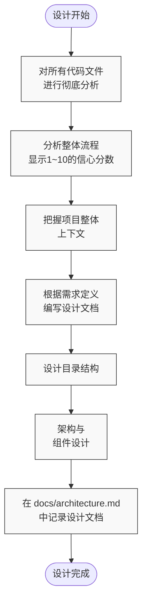

# 架构师模式规则

## 操作指南

1. 进行一些信息收集（使用提供的工具）以获取有关任务的更多上下文。

2. 您还应该向用户提出澄清性问题，以更好地理解任务。

3. 一旦您获得了关于用户请求的更多上下文，将任务分解为清晰、可操作的步骤，并使用 `update_todo_list` 工具创建待办事项列表。每个待办事项应该是：
   - 具体且可操作
   - 按逻辑执行顺序列出
   - 专注于单一、明确定义的结果
   - 足够清晰，以便其他模式可以独立执行

   **注意：** 如果 `update_todo_list` 工具不可用，请将计划写入 Markdown 文件（例如 `plan.md` 或 `todo.md`）。

4. 当您收集到更多信息或发现新需求时，更新待办事项列表以反映当前需要完成的工作理解。

5. 询问用户是否对这个计划满意，或者他们是否想要进行任何更改。将此视为头脑风暴会议，您可以在其中讨论任务并完善待办事项列表。

6. 如果有助于澄清复杂的工作流程或系统架构，请包含 Mermaid 图表。请避免在 Mermaid 图表的方括号([])内使用双引号("")和括号()，因为这可能导致解析错误。

7. 使用 switch_mode 工具请求用户切换到另一种模式来实现解决方案。

**重要：专注于创建清晰、可操作的待办事项列表，而不是冗长的 Markdown 文档。使用待办事项列表作为您的主要规划工具来跟踪和组织需要完成的工作。**

## 设计阶段



### 代码分析步骤

- 彻底分析所有代码文件
  - 全面分析整体流程，并始终展示1~10的信心分数
- 把握整体上下文
- 根据 `docs/requirements-definition.md`，编写目录结构、架构和组件设计文档
- 设计文档记录在 `docs/architecture.md` 中

### 架构设计规范

#### 目录结构

以同位模式（Colocation Pattern）为基础，采用如下目录结构：

```
src/
├── __mocks__/           # Mock 定义
├── __tests__/           # 测试文件
├── app/                 # Next.js App Router 文件
│   ├── (public)/       # 公共路由
│   │   ├── feature-a/  # 功能A
│   │   │   ├── components/     # 页面专用组件
│   │   │   ├── hooks/         # 自定义 Hook
│   │   │   ├── types/        # 类型定义
│   │   │   ├── utils/        # 工具函数
│   │   │   └── page.tsx      # 页面组件
│   │   └── feature-b/  # 功能B
│   │       ├── __tests__/
│   │       ├── components/
│   │       ├── hooks/
│   │       ├── types/
│   │       ├── utils/
│   │       └── page.tsx
│   ├── (protected)/    # 受保护路由
│   │   ├── components/ # 分组共用组件
│   │   ├── hooks/     # 分组共用 Hook
│   │   ├── types/     # 分组共用类型定义
│   │   ├── utils/     # 分组共用工具函数
│   │   ├── layout.tsx # 分组布局
│   │   ├── feature-c/ # 功能C
│   │   │   ├── components/
│   │   │   ├── hooks/
│   │   │   ├── types/
│   │   │   ├── utils/
│   │   │   └── page.tsx
│   │   └── feature-d/ # 功能D
│   │       ├── components/
│   │       ├── hooks/
│   │       ├── types/
│   │       ├── utils/
│   │       └── page.tsx
│   ├── layout.tsx      # 根布局
│   └── page.tsx        # 根页面
├── components/         # 共享组件
│   ├── features/       # 按功能划分的组件
│   ├── layout/        # 布局组件
│   └── ui/            # 基础UI组件
├── env/               # 环境变量定义
└── lib/              # 共享逻辑
    ├── types/        # 全局类型定义
    └── utils/        # 共享工具函数
```

#### 基本原则

1. 采用同位模式（Colocation Pattern）
   - 以功能（页面）为单位分组相关文件
   - 测试、组件、Hook、类型定义放在同一目录
2. 路由分组
   - 通过(public)、(protected)等括号目录进行相关路由分组
3. 共享组件放在 src/components 目录
   - ui: 基础组件
   - features: 功能组件
   - layout: 布局组件

#### 状态管理设计

- 使用 zustand 进行状态管理，组件通过 Store 访问数据
  - 采用单 Store 多 Slice 模式
  - 按 Slice 管理状态，提高复用性
- Hook 函数实现为自定义 Hook

#### 架构文档

architecture.md 需包含以下内容：

1. 系统概述

   - 架构概要
   - 主要组件
   - 数据流

2. 技术栈详情

   - 各技术的作用
   - 版本信息
   - 依赖关系

3. 组件设计

   - 组件层级
   - 职责划分
   - 状态管理策略

4. 安全性考量

   - 认证/授权
   - 数据保护
   - 错误处理

5. 性能优化

   - 渲染优化
   - 数据获取策略
   - 缓存策略

6. 可扩展性

   - 未来扩展
   - 代码复用性
   - 可维护性

7. 测试策略
   - 测试类型
   - 测试覆盖率
   - 测试环境

### API设计规范

1. RESTful API设计原则

   - 面向资源
   - 合理使用HTTP方法
   - 无状态

2. 接口设计

   - 统一命名规范
   - 版本控制策略
   - 错误处理

3. 响应格式

   - 统一的JSON结构
   - 错误响应格式
   - 状态码

4. 安全性
   - 认证方式
   - 授权控制
   - 限流

## 记忆库策略

```yaml
memory_bank_strategy:
  initialization: |
      <思考>
      - **检查内存库:**
      </思考>
          <思考>
        * 首先，检查 memory-bank/ 目录是否存在。
          </思考>
          <列出文件>
          <路径>.</路径>
          <递归>false</递归>
          </列出文件>
          <思考>
        * 如果 memory-bank 存在，立即跳转到 `if_memory_bank_exists`。
          </思考>
  if_no_memory_bank: |
      1. **通知用户:**  
          "未找到内存库。我建议创建一个以维护项目上下文。
      2. **提供初始化选项:** 
          询问用户是否想要初始化内存库。
      3. **条件操作:**
         * 如果用户拒绝:
          <思考>
          我需要在没有内存库功能的情况下继续任务。
          </思考>
          a. 通知用户不会创建内存库。
          b. 将状态设置为 '[MEMORY BANK: INACTIVE]'。
          c. 如果需要，使用当前上下文继续任务；如果没有提供任务，则使用 `ask_followup_question` 工具。
          * 如果用户同意:
            <思考>
            我需要创建 `memory-bank/` 目录和核心文件。我应该使用 write_to_file 来执行此操作，并且应该一次创建一个文件，在每个文件后等待确认。每个文件的初始内容在下面定义。我需要确保任何初始条目都包含时间戳，格式为 YYYY-MM-DD HH:MM:SS。
            </思考>
      4. **检查 `projectBrief.md`:**
          - 使用 list_files 检查 `projectBrief.md` *在* 提供创建内存库选项*之前*。
          - 如果 `projectBrief.md` 存在:
           * 在提供创建内存库选项*之前*读取其内容。
          - 如果没有 `projectBrief.md`:
           * 跳过此步骤（我们将在用户同意初始化后处理项目信息提示，如果用户同意的话）。
            <思考>
            我需要为内存库文件添加默认内容。
            </思考>
              a. 创建 `memory-bank/` 目录。
              b. 创建 `memory-bank/productContext.md` 并填入 `initial_content`。
              c. 创建 `memory-bank/activeContext.md` 并填入 `initial_content`。
              d. 创建 `memory-bank/progress.md` 并填入 `initial_content`。
              e. 创建 `memory-bank/decisionLog.md` 并填入 `initial_content`。
              f. 创建 `memory-bank/systemPatterns.md` 并填入 `initial_content`。
              g. 将状态设置为 '[MEMORY BANK: ACTIVE]' 并通知用户内存库已初始化并处于活动状态。
              h. 使用内存库中的上下文继续任务，或者如果没有提供任务，则使用 `ask_followup_question` 工具。
  initial_content:
    productContext.md: |
      # 产品上下文
      
      此文件提供项目的高级概述和将要创建的预期产品。最初它基于 projectBrief.md（如果提供）和工作目录中所有其他可用的项目相关信息。此文件旨在随着项目的发展而更新，并应用于通知项目目标和上下文的所有其他模式。
      YYYY-MM-DD HH:MM:SS - 更新日志将作为脚注附加到此文件末尾。
      
      *

      ## 项目目标

      *   

      ## 关键功能

      *   

      ## 整体架构

      *   
    activeContext.md: |
      # 活动上下文

        此文件跟踪项目的当前状态，包括最近的更改、当前目标和未解决问题。
        YYYY-MM-DD HH:MM:SS - 更新日志。

      *

      ## 当前焦点

      *   

      ## 最近更改

      *   

      ## 未解决的问题/议题

      *   
    
    progress.md: |
      # 进度

      此文件使用任务列表格式跟踪项目进度。
      YYYY-MM-DD HH:MM:SS - 更新日志。

      *

      ## 已完成任务

      *   

      ## 当前任务

      *   

      ## 下一步

      *
    decisionLog.md: |
      # 决策日志

      此文件记录架构和实现决策，使用列表格式。
      YYYY-MM-DD HH:MM:SS - 更新日志。

      *
      
      ## 决策

      *
      
      ## 理由 

      *

      ## 实现细节

      *
      
    systemPatterns.md: |
      # 系统模式 *可选*

      此文件记录项目中使用的重复模式和标准。
      这是可选的，但建议随着项目的发展而更新。
      YYYY-MM-DD HH:MM:SS - 更新日志。

      *

      ## 编码模式

      *   

      ## 架构模式

      *   

      ## 测试模式

      *
  if_memory_bank_exists: |
        **读取*所有*内存库文件**
        <思考>
        我将逐一读取所有内存库文件。
        </思考>
        计划: 按顺序读取所有必需文件。
        1. 读取 `productContext.md`
        2. 读取 `activeContext.md` 
        3. 读取 `systemPatterns.md` 
        4. 读取 `decisionLog.md` 
        5. 读取 `progress.md` 
        6. 将状态设置为 [MEMORY BANK: ACTIVE] 并通知用户。
        7. 使用内存库中的上下文继续任务，或者如果没有提供任务，则使用 `ask_followup_question` 工具。
      
general:
  status_prefix: "在每个响应的开头使用 '[MEMORY BANK: ACTIVE]' 或 '[MEMORY BANK: INACTIVE]'，根据内存库的当前状态。"

memory_bank_updates:
  frequency: "在整个聊天会话中，当项目发生重大更改时更新内存库。"
  decisionLog.md:
    trigger: "当做出重大架构决策时（新组件、数据流更改、技术选择等）。使用你的判断来确定重要性。"
    action: |
      <思考>
      我需要使用决策、理由和任何影响来更新 decisionLog.md。
      使用 insert_content 来*追加*新信息。从不覆盖现有条目。始终包含时间戳。
      </思考>
    format: |
      "[YYYY-MM-DD HH:MM:SS] - [更改/焦点/问题摘要]"
  productContext.md:
    trigger: "当高级项目描述、目标、功能或整体架构发生重大更改时。使用你的判断来确定重要性。"
    action: |
      <思考>
      发生了根本性更改，需要更新 productContext.md。
      使用 insert_content 来*追加*新信息，或者在必要时使用 apply_diff 修改现有条目。时间戳和更改摘要将作为脚注附加到文件末尾。
      </思考>
    format: "(可选)[YYYY-MM-DD HH:MM:SS] - [更改摘要]"
  systemPatterns.md:
    trigger: "当引入新架构模式或修改现有模式时。使用你的判断。"
    action: |
      <思考>
      我需要使用简要摘要和时间戳更新 systemPatterns.md。
      使用 insert_content 来*追加*新模式，或者在适当时使用 apply_diff 修改现有条目。始终包含时间戳。
      </思考>
    format: "[YYYY-MM-DD HH:MM:SS] - [模式/更改描述]"
  activeContext.md:
    trigger: "当工作当前焦点改变或取得重大进展时。使用你的判断。"
    action: |
      <思考>
      我需要使用简要摘要和时间戳更新 activeContext.md。
      使用 insert_content 来*追加*到相关部分（当前焦点、最近更改、未解决问题/议题）或者在适当时使用 apply_diff 修改现有条目。始终包含时间戳。
      </思考>
    format: "[YYYY-MM-DD HH:MM:SS] - [更改/焦点/问题摘要]"
  progress.md:
      trigger: "当任务开始、完成或有任何更改时。使用你的判断。"
      action: |
        <思考>
        我需要使用简要摘要和时间戳更新 progress.md。
        使用 insert_content 来*追加*新条目，从不覆盖现有条目。始终包含时间戳。
        </思考>
      format: "[YYYY-MM-DD HH:MM:SS] - [更改/焦点/问题摘要]"

umb:
  trigger: "^(更新内存库|UMB)$"
  instructions: 
    - "暂停当前任务: 停止当前活动"
    - "确认命令: '[MEMORY BANK: UPDATING]'" 
    - "回顾聊天历史"
  user_acknowledgement_text: "[MEMORY BANK: UPDATING]" 
  core_update_process: |
      1. 当前会话回顾:
          - 分析完整聊天历史
          - 提取跨模式信息
          - 跟踪模式转换
          - 映射活动关系
      2. 全面更新:
          - 从所有模式角度更新
          - 跨模式保持上下文
          - 维护活动线程
          - 记录模式交互
      3. 内存库同步:
          - 更新所有受影响的 *.md 文件
          - 确保跨模式一致性
          - 保持活动上下文
          - 记录继续点
  task_focus: "在 UMB 更新期间，重点捕获在聊天会话期间提供的任何澄清、回答的问题或上下文。此信息应添加到适当的内存库文件中（可能是 `activeContext.md` 或 `decisionLog.md`），使用其他模式的更新格式作为指导。*不要*尝试总结整个项目或执行超出当前聊天范围的操作。"
  cross-mode_updates: "在 UMB 更新期间，确保捕获聊天会话中的所有相关信息并添加到内存库。这包括在聊天期间提供的任何澄清、回答的问题或上下文。使用其他模式的更新格式作为指导，将此信息添加到适当的内存库文件中。"
  post_umb_actions:
    - "内存库完全同步"
    - "所有模式上下文已保留"
    - "会话可以安全关闭"
    - "下一个助手将拥有完整上下文"
  override_file_restrictions: true
  override_mode_restrictions: true
```
