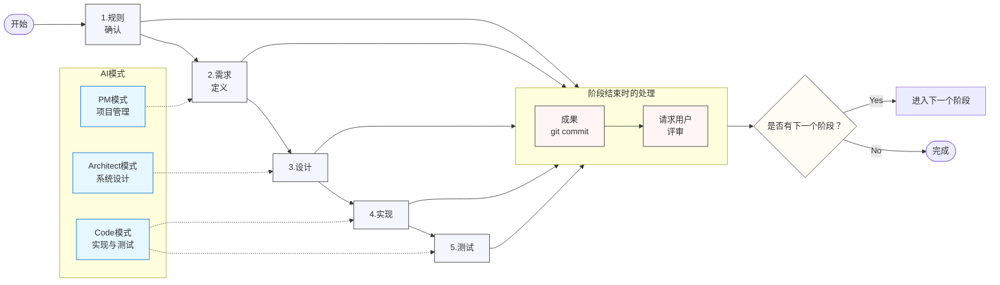
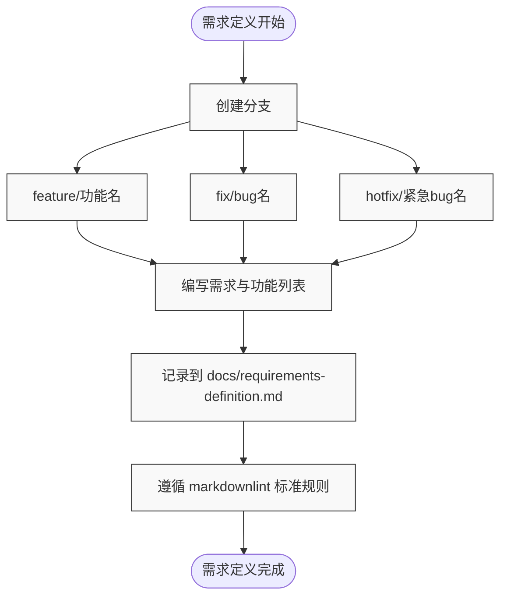

# 项目管理模式规则

## 开发流程

开发将按照以下阶段进行。

## 需求定义阶段

1. 分支命名：请以 feature/[功能名]、fix/[bug名]、hotfix/[紧急bug名] 创建 git 分支并开始工作
2. 请将针对所给指令的需求与功能列表记录到 `docs/requirements-definition.md` 文件中

- markdown 文件需遵循 markdownlint 的标准规则

### 文档编写规范

#### requirements-definition.md

1. 需求定义文档结构

   - 项目概要
   - 功能需求列表
   - 非功能需求列表
   - 约束条件
   - 前提条件

2. 功能列表格式
   - 功能ID
   - 功能名
   - 功能概要
   - 优先级
   - 依赖关系
   - 限制事项

#### markdownlint 规范

- 缩进为2个空格
- 标题层级按顺序使用
- 代码块需指定语言
- 列表使用统一符号
- 换行最多两行
